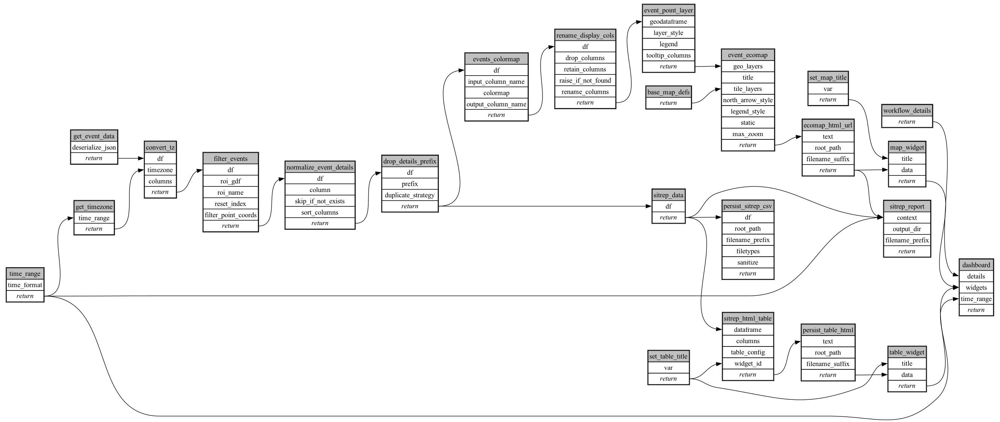

```
# AUTOGENERATED BY ECOSCOPE-WORKFLOWS; see fingerprint in README.md for details

```

```yaml
# fingerprint:
artifacts_sha256_basic: dcfeff1d2934ee920ca961357fb6176a34406c0c87b5674adecf615aaae3575b
artifacts_sha256_strict: fb21d51a7ae7d005554880022ba4161c10e15f6d6d2fcafcbcae7a6ebdb9c112
installed_requirements:
- channel: https://repo.prefix.dev/ecoscope-workflows/
  name: ecoscope-workflows-core
  version: {version: ==0.22.14}
- channel: https://repo.prefix.dev/ecoscope-workflows/
  name: ecoscope-workflows-ext-ecoscope
  version: {version: ==0.22.17}
- channel: https://repo.prefix.dev/ecoscope-workflows-custom/
  name: ecoscope-workflows-ext-custom
  version: {version: ==0.0.41}
- channel: https://repo.prefix.dev/ecoscope-workflows-custom/
  name: ecoscope-workflows-ext-mt
  version: {version: ==10000.dev2+g16475aa35}
params_sha256: af653f25a5264de779bb28e1d26fcc5c708cff8831ded38ae8b1de65d37ec2f5
spec_sha256: 3f8f90560f53f68756cb7445c5d92b28bf33cf64cfadbafd6cbd27c7fcce5b2a

```

# ecoscope-workflows-mt-security-workflow


