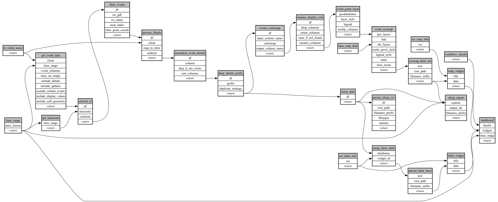

```
# AUTOGENERATED BY ECOSCOPE-WORKFLOWS; see fingerprint in README.md for details

```

```yaml
# fingerprint:
artifacts_sha256_basic: 6293549d1b7189b1ac8d659c42d3494a0ecbf910b348b269de0e5580abac5ed0
artifacts_sha256_strict: b3e46fcf66f961e23787dd7f3ccb59f5c347210623d85e7b7157a81f059c95a0
installed_requirements:
- channel: https://repo.prefix.dev/ecoscope-workflows/
  name: ecoscope-workflows-core
  version: {version: ==0.22.14}
- channel: https://repo.prefix.dev/ecoscope-workflows/
  name: ecoscope-workflows-ext-ecoscope
  version: {version: ==0.22.17}
- channel: https://repo.prefix.dev/ecoscope-workflows-custom/
  name: ecoscope-workflows-ext-custom
  version: {version: ==0.0.41}
- channel: https://repo.prefix.dev/ecoscope-workflows-custom/
  name: ecoscope-workflows-ext-mt
  version: {version: ==10000.dev2+g75b791f0e}
params_sha256: e3d836d4dc487ac0281670ded678c25dd1360bc0b9dfd90895929adeab13d3f7
spec_sha256: 656b883d55ac61e8ee0f87131fa8a54c65d31d2f3dec04da5f6f895547a174af

```

# ecoscope-workflows-mt-sitrep-workflow


